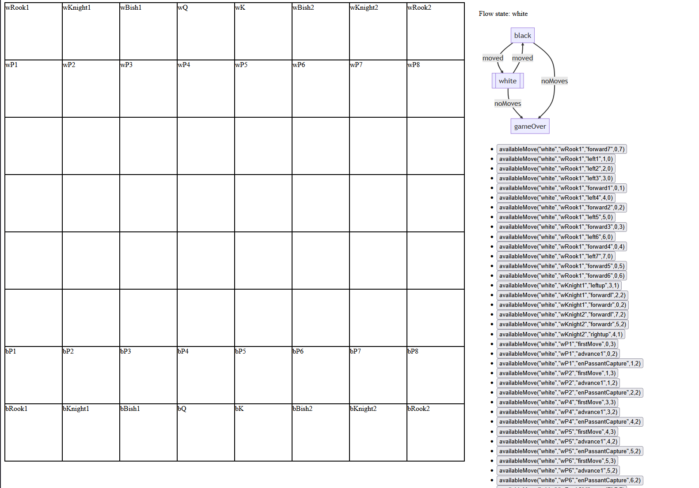
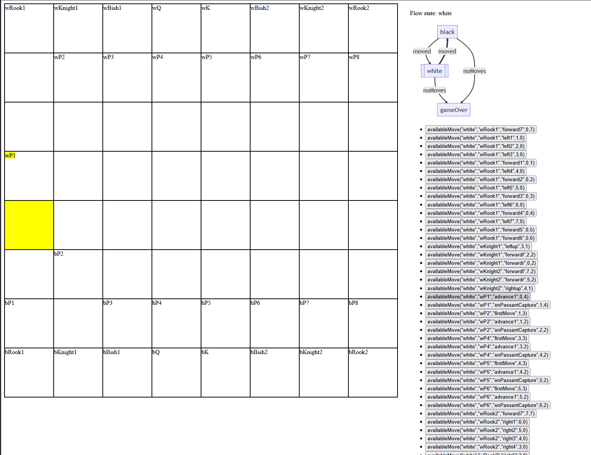

# Chess example
This example shows the outputs of the chess example

## starting state

## after 2 moves

Here you can clearly see that the rules are preventing the piece that has moved of its starting position from executing a firstMove action in this case moving forward twice.